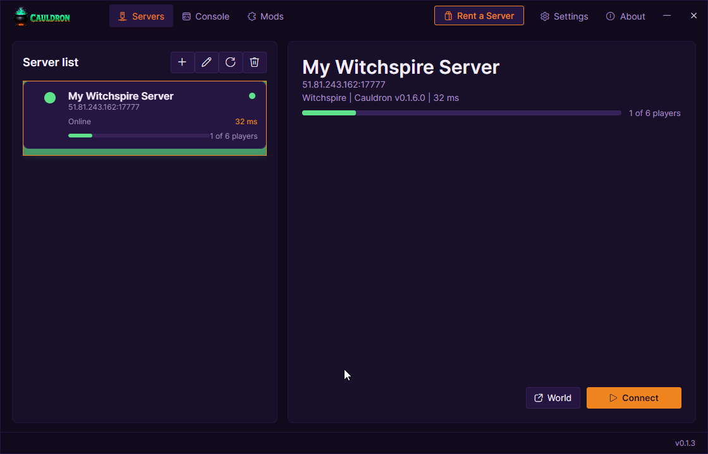

  <picture>
    <source media="(prefers-color-scheme: dark)" srcset="docs/img/cauldron-lockup-dark.png">
    
  </picture>

  
  
  

# Cauldron

Cauldron gives **Witchspire** dedicated, always-on multiplayer worlds. A host runs the Cauldron server package next to Witchspire on a Windows box, players join through the Cauldron desktop app with a single join code, and the world stays on the server with snapshots, admin tools, server query, and a mod kit. No friend-join lobby, no host-must-be-online requirement, no second player needed to keep the world alive.

A Cauldron server stands up a headless Witchspire host and publishes it as a joinable session. The Cauldron app resolves the server's join code to that exact session and connects the player straight into the hosted world. Stock Witchspire cannot join a Cauldron server directly — every player runs the Cauldron app, which ships the client mod that performs the join.

  

## Features

### Join by code
Add a server's join code once, pick your character, and connect straight into the hosted world from the launcher — no lobby invite, no friends list.

### Server-side worlds
The world lives on the host machine. The server keeps running after a player leaves, and save snapshots give admins a recovery point before major changes.

### Snapshots and rollback
Admins can take snapshots, list saved worlds, and restore a previous world from Cauldron's world tools or RCON.

### Multiple characters
Players can keep separate characters per server. Cauldron remembers the character you used for each saved server.

### Admin console
CauldronServer exposes Source RCON on the server's RCON port for commands like `help`, `status`, `players`, `ping`, `save snapshot`, and `save list`.

### Server query
CauldronServer answers Source A2S query so server lists, monitoring tools, and bots can read status and player counts.

### Mods
The host runs the `cauldron_host` overlay mod, which stands up the joinable session and applies the headless-host fixes. The Cauldron app ships the `CauldronConnect` client mod that performs the join. Self-hosters can add their own AngelScript mods to the host.

## Install

### Managed hosting
The shortest path is [SurvivalServers.com Witchspire hosting](https://www.survivalservers.com/services/game_servers/witchspire/?utm_source=github&utm_medium=readme_install&utm_campaign=cauldron). Cauldron is already installed, the server is configured, and the panel shows the join code plus a one-click Cauldron setup link for players.

### Players
1. Download `CauldronSetup-<version>.exe` from the [latest release](https://github.com/HumanGenome/Cauldron/releases/latest).
2. Run the installer. Windows SmartScreen may warn because the installer is not code-signed yet; choose **More info** then **Run anyway**.
3. Open Cauldron, add the server's join code, select or create a character, and click **Connect**.

Cauldron checks for launcher updates automatically on launch and while it is running.

### Self-hosted servers
1. Download `Cauldron-Server-Windows-x64-v<version>.zip` from the [latest release](https://github.com/HumanGenome/Cauldron/releases/latest). It is self-contained — it includes the supervisor (`CauldronServer\`), the host overlay mods, and the host auth/launch helpers.
2. Install the Witchspire dedicated files (SteamCMD app `2679100`) into the folder set in `CauldronServer\appsettings.json`. CauldronServer launches the game from that folder; it does not ship the game.
3. Edit `CauldronServer\appsettings.json` (server name, ports, `RconPassword`).
4. Open the query UDP port, RCON TCP port, and admin HTTP TCP port. Joins ride the game's session transport, so there is no gameplay UDP port to forward.
5. Run `CauldronServer\CauldronServer.exe`.

Full server setup, settings, source-query examples, RCON commands, and the runtime boot recipe live in [HumanGenome/CauldronServer](https://github.com/HumanGenome/CauldronServer).

## Releases

The public release page is intentionally simple:

- `CauldronSetup-<version>.exe` — installer for players
- `Cauldron-Server-Windows-x64-v<version>.zip` — server package for hosts
- `checksums.txt` — hashes for the release assets

Source archives are generated by GitHub automatically for tags.

## Source

This repository is the download and documentation hub for released Cauldron builds.

CauldronServer (the .NET host supervisor, RCON, query, and admin API) source is public at [HumanGenome/CauldronServer](https://github.com/HumanGenome/CauldronServer).

## Community Note

Cauldron is a community project and is not affiliated with or endorsed by the developers of Witchspire.

## License

See [LICENSE](LICENSE).

## Credits

- [Avalonia](https://avaloniaui.net/) — .NET UI framework used by Cauldron
